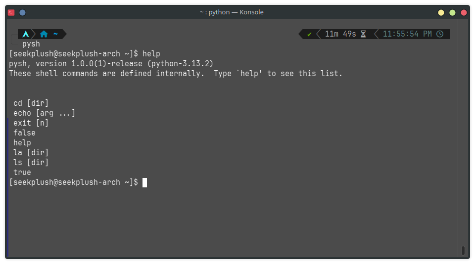

# pysh
Bash commands (kinda) and its default prompt ported to Python
\
I made this out of boredom and just for fun so don't expect me to update it a lot

## Installation
Get the latest release in the Releases tab or simply [click here](https://github.com/SeekPlush-linux/pysh/releases) and download one of the files\
Extract it, install the required dependencies from `requirements.txt` by typing this command: `pip install -r requirements.txt`\
Then launch `pysh.py` with `python3 pysh.py`

Enjoy :3
